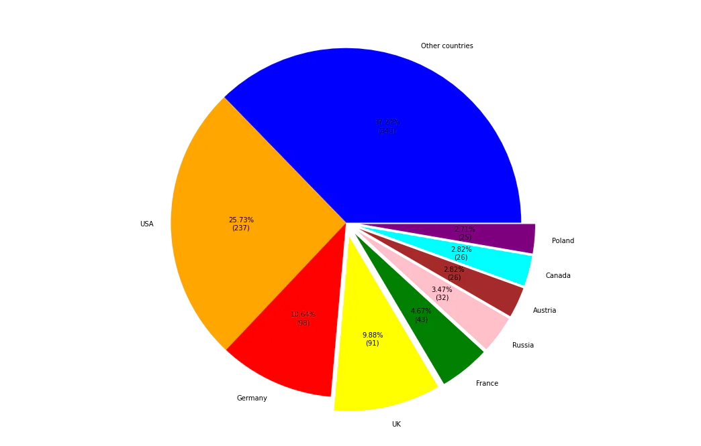

# Stage 4/6: Plot a pie chart
## Description
A pie chart is really useful for displaying fractions; use it to illustrate the Nobel laureates countries of origin.  
As many of the countries fractions are minimal, you will need to work on the data to modify it.

## Objectives
Plot the exact pie chart as depicted below, using the country of birth information.
1. Re-code the countries. If the number of the Nobel Laureates born in the country is less than 25, re-code it to  
   the `Other countries` group;
2. Use the following colors: `blue`, `orange`, `red`, `yellow`, `green`, `pink`, `brown`, `cyan`, `purple`;
3. Set figure size to `(12, 12)`;
4. For countries whose slices are _exploded_, set the `explode` parameter to `0.08`.

**Tip:**  
Use `autopct` parameter to calculate and format the values. The format of the text displayed on the slices is `{:.2f}%\n({:.0f})`.

## Example
### Example 1:
_Be careful. Your image should be the same as in the example._

