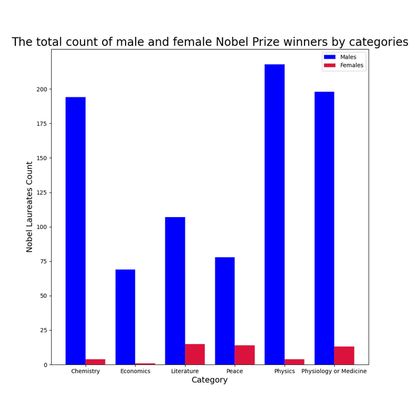

# Stage 5/6: Plot a bar plot
## Description
A bar chart is helpful if you want to plot the distribution of values across several categories. In this case, let's  
plot a grouped bar plot for each Nobel Prize category to compare the shares of male and female Nobel laureates.

## Objectives
Generate the following grouped bar plot:
1. Drop all the rows where the category column does not contain any values.
2. Set figure size to `(10, 10)`;
3. The bar centers are moved by `0.2` from the tick center, the width of bars is `0.4`;
4. The bars corresponding to males and females are of ` "blue" ` and ` "crimson" ` colours respectively;
5. The axis font size is `14`, the plot font size is `20`.

## Example
### Example 1:

_Be careful. Your image should be the same as in the example._

