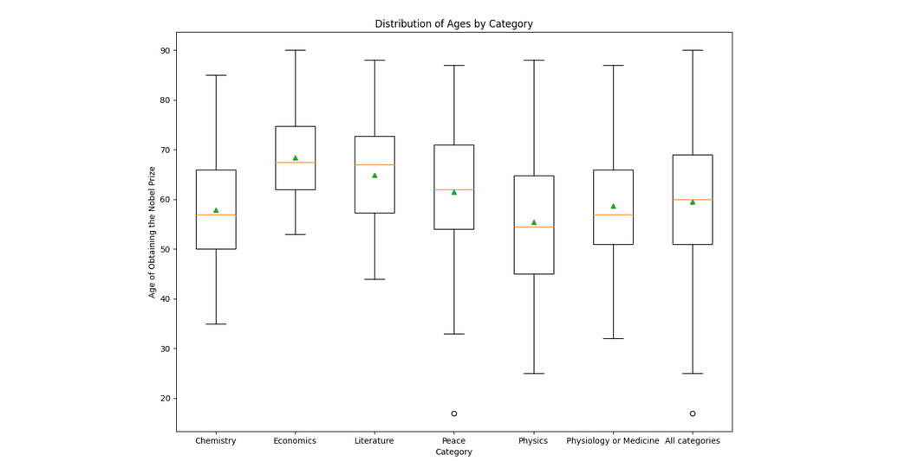

# Stage 6/6: Plot a box plot
## Description
A box plot is really helpful for displaying the distributions, let's use it to plot the age distribution of the Nobel Prize winners in each category.

## Objectives
Generate a box plot for ages of getting the Nobel Prize for each category:
1. Set figure size to `(10, 10)`;
2. Set the font size of the axis labels to 14 and the font size of the plot label is `20`;
3. Display the mean age of obtaining the Nobel Prize in each category (green triangle in the image below).

## Example
### Example 1:

_Be careful. Your image should be the same as in the sample._

